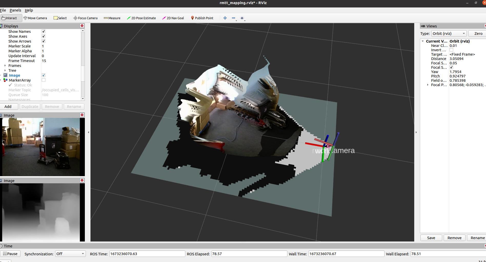

RoboMaster Tello Talent ROS package. Developed by Tianbot

# rmtt_midas package for RoboMaster Tello Talent (RMTT) 

+ Tested with ROS2GO Noetic version , cuda11.3 , libtorch1.13.1
+ Add  depth image to pcl point cloud and publish /point_cloud topic.
+ Reference: https://github.com/isl-org/MiDaS

## Installation Instructions

### Install cuda and cudnn(optional)

Dowload and install instructions can be found at: https://pytorch.org/

### Install pcl and pcl-tools

```
sudo apt install libpcl-dev pcl-tools
```

### Download model weight file

```
roscd rmtt_midas
wget https://github.com/isl-org/MiDaS/releases/download/v2_1/model-small-traced.pt
```

## Usage Instructions

+ Start rmtt_midas with cuda:

  ```
  roslaunch rmtt_midas midas.launch
  ```

+ Start rmtt_midas with cpu:

  ```
  roslaunch rmtt_midas midas.launch kdevice:=kCPU
  ```


Run rmtt_midas with ros bag:




# Citation

This repository contains code to compute depth from a single image. It accompanies our [paper](https://arxiv.org/abs/1907.01341v3):

> Towards Robust Monocular Depth Estimation: Mixing Datasets for Zero-shot Cross-dataset Transfer
> René Ranftl, Katrin Lasinger, David Hafner, Konrad Schindler, Vladlen Koltun

Please cite our paper if you use this code or any of the models:

```
@article{Ranftl2020,
	author    = {Ren\'{e} Ranftl and Katrin Lasinger and David Hafner and Konrad Schindler and Vladlen Koltun},
	title     = {Towards Robust Monocular Depth Estimation: Mixing Datasets for Zero-shot Cross-dataset Transfer},
	journal   = {IEEE Transactions on Pattern Analysis and Machine Intelligence (TPAMI)},
	year      = {2020},
}
```