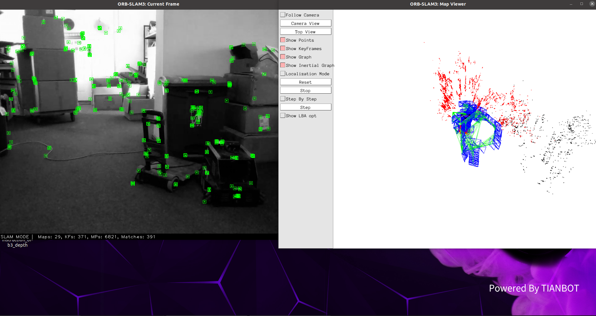
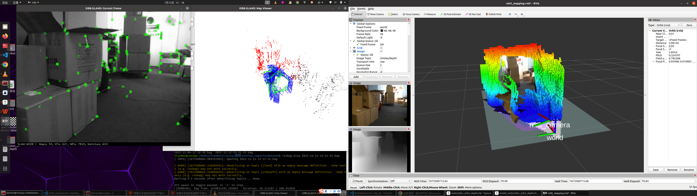

RoboMaster Tello Talent ROS package. Developed by Tianbot

# rmtt_orb3 package for RoboMaster Tello Talent (RMTT) 

+ Tested with ROS2GO Noetic version , eigen-3.4.0 and Pangolin-0.6.
+ Built with catkin_make and  publish /tf topic.
+ Add sparse map display with pcl.
+ Reference:,[ORB-SLAM3](https://github.com/UZ-SLAMLab/ORB_SLAM3) , https://github.com/zdf-star/ORB_SLAM3_ros

## Installation Instructions

### Install pcl and pcl-tools

```
sudo apt install libpcl-dev pcl-tools
```

### Build Pangolin v0.6

We use [Pangolin](https://github.com/stevenlovegrove/Pangolin) for visualization and user interface. Dowload and install instructions can be found at: https://github.com/stevenlovegrove/Pangolin.

```
git clone -b v0.6 https://github.com/stevenlovegrove/Pangolin.git
sudo apt install libgl1-mesa-dev libglew-dev
cd Pangolin
mkdir build
cd build
cmake .. -DCMAKE_BUILD_TYPE=Release
make -j6 
sudo make install
```

### Build eigen v3.4.0

Required by g2o . Download eigen v3.4.0 at: [http://eigen.tuxfamily.org](http://eigen.tuxfamily.org/). 

```
cd eigen-3.4.0
mkdir build
cd build
cmake .. -DCMAKE_BUILD_TYPE=Release
make -j6
sudo make install
```

### Build Thirdparty
```shell
roscd rmtt_ros
git clone https://github.com/tianbot/rmtt_orb3.git
 # DBow 
cd rmtt_orb3/src/Thirdparty/DBoW2
mkdir build
cd build
cmake .. -DCMAKE_BUILD_TYPE=Release
make -j6
# g2o
roscd rmtt_ros
cd rmtt_orb3/src/Thirdparty/g2o
mkdir build
cd build
cmake .. -DCMAKE_BUILD_TYPE=Release
make -j6
# Sophus
roscd rmtt_ros
cd rmtt_orb3/src/Thirdparty/Sophus
mkdir build
cd buildshell
cmake .. -DCMAKE_BUILD_TYPE=Release
make -j6
# Uncompress Vocabulary
roscd rmtt_ros
cd rmtt_orb3/src/Vocabulary
cd Vocabulary
tar -xf ORBvoc.txt.tar.gz
```
### Install rmtt_orb3 package
```
cd ~/tianbot_ws
catkin_make -j6
```
## Usage Instructions

### Start rmtt_orb3  

```
roslaunch rmtt_orb3 rmtt_orb3.launch
```

+ Run rmtt_orb3 with ros bag:




### Run rmtt_orb3 with rmtt_midas, octomap and RMTT

+ You need to start the RMTT node before starting others.

  ```
  roslaunch rmtt_driver rmtt_bringup.launch drone_ip:=xxx.xxx.xxx.xxx
  ```

+ See rmtt_midas  instructions in rmtt_midas package.

+ See rmtt  instructions in rmtt_driver package.

+ Install octomap:

  ```
  sudo apt install ros-noetic-octomap ros-noetic-octomap-mapping ros-noetic-octomap-server
  ```

```
roslaunch rmtt_orb3 rmtt_slam.launch
```



## Topics

Published topics:

+ ~/midas/depth[sensor_msgs/Image]
+ ~/midas/pointcloud[sensor_msgs/PointCloud2]
+ ~/tf[tf2_msgs/TFMessage]

Subscribed topics:

+ ~/image_raw[sensor_msgs/Image]

Services:

+ ~/occupied_cells_vis_array[visualization_msgs/MarkerArray]

+ ~/projected_map[nav_msgs/OccupancyGrid]


# ORB-SLAM3

### V1.0, December 22th, 2021
**Authors:** Carlos Campos, Richard Elvira, Juan J. Gómez Rodríguez, [José M. M. Montiel](http://webdiis.unizar.es/~josemari/), [Juan D. Tardos](http://webdiis.unizar.es/~jdtardos/).

The [Changelog](https://github.com/UZ-SLAMLab/ORB_SLAM3/blob/master/Changelog.md) describes the features of each version.

ORB-SLAM3 is the first real-time SLAM library able to perform **Visual, Visual-Inertial and Multi-Map SLAM** with **monocular, stereo and RGB-D** cameras, using **pin-hole and fisheye** lens models. In all sensor configurations, ORB-SLAM3 is as robust as the best systems available in the literature, and significantly more accurate. 

We provide examples to run ORB-SLAM3 in the [EuRoC dataset](http://projects.asl.ethz.ch/datasets/doku.php?id=kmavvisualinertialdatasets) using stereo or monocular, with or without IMU, and in the [TUM-VI dataset](https://vision.in.tum.de/data/datasets/visual-inertial-dataset) using fisheye stereo or monocular, with or without IMU. Videos of some example executions can be found at [ORB-SLAM3 channel](https://www.youtube.com/channel/UCXVt-kXG6T95Z4tVaYlU80Q).

This software is based on [ORB-SLAM2](https://github.com/raulmur/ORB_SLAM2) developed by [Raul Mur-Artal](http://webdiis.unizar.es/~raulmur/), [Juan D. Tardos](http://webdiis.unizar.es/~jdtardos/), [J. M. M. Montiel](http://webdiis.unizar.es/~josemari/) and [Dorian Galvez-Lopez](http://doriangalvez.com/) ([DBoW2](https://github.com/dorian3d/DBoW2)).

### Related Publications:

[ORB-SLAM3] Carlos Campos, Richard Elvira, Juan J. Gómez Rodríguez, José M. M. Montiel and Juan D. Tardós, **ORB-SLAM3: An Accurate Open-Source Library for Visual, Visual-Inertial and Multi-Map SLAM**, *IEEE Transactions on Robotics 37(6):1874-1890, Dec. 2021*. **[PDF](https://arxiv.org/abs/2007.11898)**.

[IMU-Initialization] Carlos Campos, J. M. M. Montiel and Juan D. Tardós, **Inertial-Only Optimization for Visual-Inertial Initialization**, *ICRA 2020*. **[PDF](https://arxiv.org/pdf/2003.05766.pdf)**

[ORBSLAM-Atlas] Richard Elvira, J. M. M. Montiel and Juan D. Tardós, **ORBSLAM-Atlas: a robust and accurate multi-map system**, *IROS 2019*. **[PDF](https://arxiv.org/pdf/1908.11585.pdf)**.

[ORBSLAM-VI] Raúl Mur-Artal, and Juan D. Tardós, **Visual-inertial monocular SLAM with map reuse**, IEEE Robotics and Automation Letters, vol. 2 no. 2, pp. 796-803, 2017. **[PDF](https://arxiv.org/pdf/1610.05949.pdf)**. 

[Stereo and RGB-D] Raúl Mur-Artal and Juan D. Tardós. **ORB-SLAM2: an Open-Source SLAM System for Monocular, Stereo and RGB-D Cameras**. *IEEE Transactions on Robotics,* vol. 33, no. 5, pp. 1255-1262, 2017. **[PDF](https://arxiv.org/pdf/1610.06475.pdf)**.

[Monocular] Raúl Mur-Artal, José M. M. Montiel and Juan D. Tardós. **ORB-SLAM: A Versatile and Accurate Monocular SLAM System**. *IEEE Transactions on Robotics,* vol. 31, no. 5, pp. 1147-1163, 2015. (**2015 IEEE Transactions on Robotics Best Paper Award**). **[PDF](https://arxiv.org/pdf/1502.00956.pdf)**.

[DBoW2 Place Recognition] Dorian Gálvez-López and Juan D. Tardós. **Bags of Binary Words for Fast Place Recognition in Image Sequences**. *IEEE Transactions on Robotics,* vol. 28, no. 5, pp. 1188-1197, 2012. **[PDF](http://doriangalvez.com/php/dl.php?dlp=GalvezTRO12.pdf)**

# License

ORB-SLAM3 is released under [GPLv3 license](https://github.com/UZ-SLAMLab/ORB_SLAM3/LICENSE). For a list of all code/library dependencies (and associated licenses), please see [Dependencies.md](https://github.com/UZ-SLAMLab/ORB_SLAM3/blob/master/Dependencies.md).

For a closed-source version of ORB-SLAM3 for commercial purposes, please contact the authors: orbslam (at) unizar (dot) es.

If you use ORB-SLAM3 in an academic work, please cite:

    @article{ORBSLAM3_TRO,
      title={{ORB-SLAM3}: An Accurate Open-Source Library for Visual, Visual-Inertial 
               and Multi-Map {SLAM}},
      author={Campos, Carlos AND Elvira, Richard AND G\´omez, Juan J. AND Montiel, 
              Jos\'e M. M. AND Tard\'os, Juan D.},
      journal={IEEE Transactions on Robotics}, 
      volume={37},
      number={6},
      pages={1874-1890},
      year={2021}
     }

