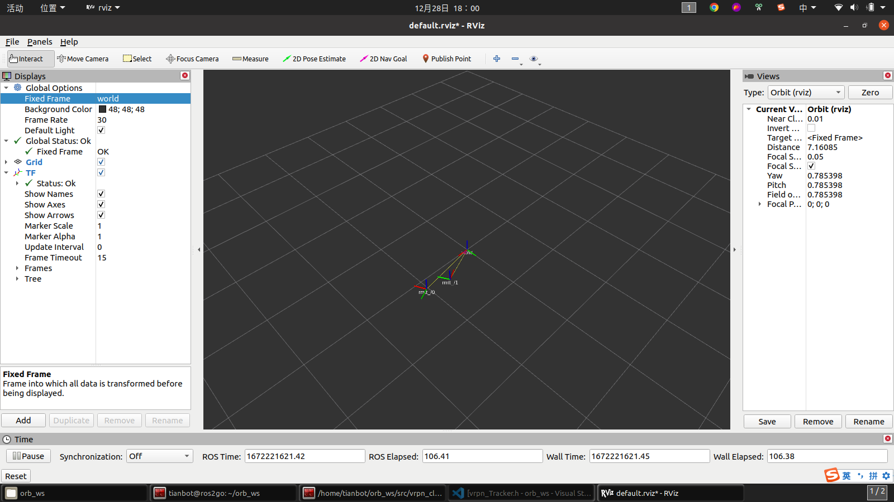
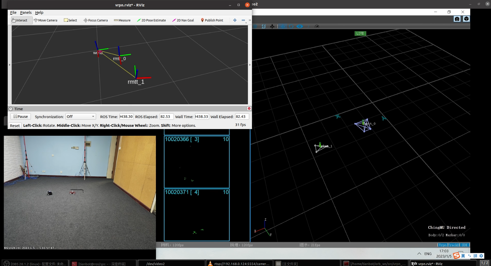

RoboMaster Tello Talent ROS package. Developed by Tianbot

# rmtt_vrpn_client package for RoboMaster Tello Talent (RMTT) 

+ Tested with ROS2GO Noetic version.
+ Reference: vrpn：https://github.com/vrpn/vrpn  vrpn_client_ros：https://github.com/ros-drivers/vrpn_client_rosimage-20230116102857120 

## Installation Instructions

### Install ros vrpn package

```
sudo apt install ros-noetic-vrpn
```

## Usage Instructions

1:  Check the VRPN server list in CMtracker to query the IP address.


2: Confirm the robot name list and its corresponding unique ID number.

```
# For example, the corresponding ID of [rmtt, tbmn, rmtt, tbmn] is 0,1,2,3.
  <arg name="robot_name_list" default="[rmtt, tbmn, rmtt, tbmn]"/>
```

3: Start rmtt_vrpn_client.launch and build connection to CMtracker.

```
roslaunch rmtt_vrpn_client rmtt_connection.launch server:=xxx.xxx.xxx.xxx 
```






# LICENSE

```
Copyright 2015 Clearpath Robotics Inc.

Redistribution and use in source and binary forms, with or without modification, are permitted provided that the following conditions are met:

1. Redistributions of source code must retain the above copyright notice, this list of conditions and the following disclaimer.

2. Redistributions in binary form must reproduce the above copyright notice, this list of conditions and the following disclaimer in the documentation and/or other materials provided with the distribution.

3. Neither the name of the copyright holder nor the names of its contributors may be used to endorse or promote products derived from this software without specific prior written permission.

THIS SOFTWARE IS PROVIDED BY THE COPYRIGHT HOLDERS AND CONTRIBUTORS "AS IS" AND ANY EXPRESS OR IMPLIED WARRANTIES, INCLUDING, BUT NOT LIMITED TO, THE IMPLIED WARRANTIES OF MERCHANTABILITY AND FITNESS FOR A PARTICULAR PURPOSE ARE DISCLAIMED. IN NO EVENT SHALL THE COPYRIGHT HOLDER OR CONTRIBUTORS BE LIABLE FOR ANY DIRECT, INDIRECT, INCIDENTAL, SPECIAL, EXEMPLARY, OR CONSEQUENTIAL DAMAGES (INCLUDING, BUT NOT LIMITED TO, PROCUREMENT OF SUBSTITUTE GOODS OR SERVICES; LOSS OF USE, DATA, OR PROFITS; OR BUSINESS INTERRUPTION) HOWEVER CAUSED AND ON ANY THEORY OF LIABILITY, WHETHER IN CONTRACT, STRICT LIABILITY, OR TORT (INCLUDING NEGLIGENCE OR OTHERWISE) ARISING IN ANY WAY OUT OF THE USE OF THIS SOFTWARE, EVEN IF ADVISED OF THE POSSIBILITY OF SUCH DAMAGE.
```

